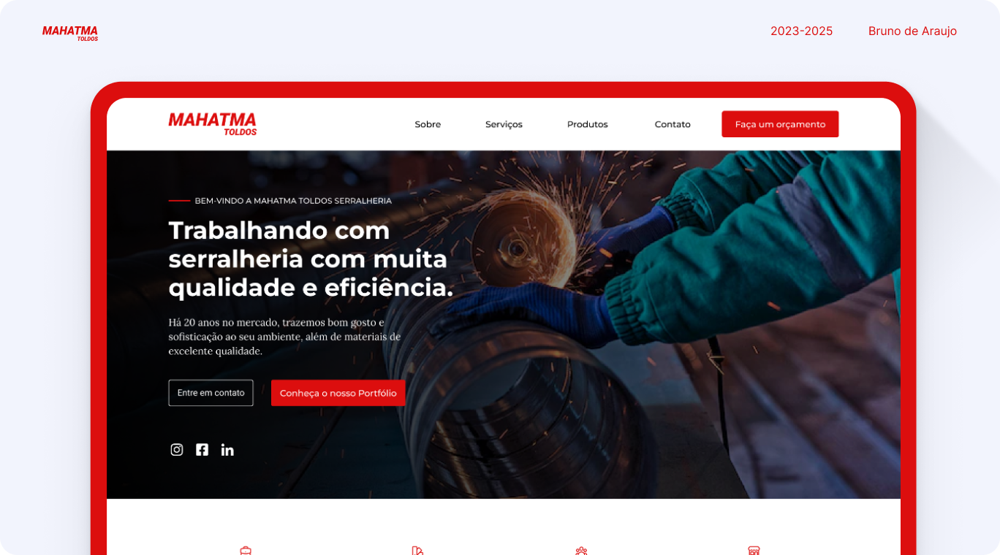

# Mahatma Toldos – Serralheria

✅ Projeto real desenvolvido como página interna para divulgar os serviços de serralheria da empresa **Mahatma Toldos**.

🔗 Acesse o site: [https://mahatmatoldos.com.br/serralheria.html](https://mahatmatoldos.com.br/serralheria.html)

## ✨ Sobre o projeto

Desenvolvido em 2023 como uma extensão do site institucional, focado exclusivamente nos serviços de serralheria oferecidos pela empresa.

## 💼 Minhas responsabilidades

- Design da interface no Figma
- Desenvolvimento com HTML, CSS e JavaScript
- Estruturação responsiva
- Atualizações pontuais sob demanda

## 🚀 Tecnologias utilizadas

Figma · HTML · CSS · JavaScript · PHP

## 📸 Prints do site

## 📍 Status do projeto

✔️ Concluído e publicado
